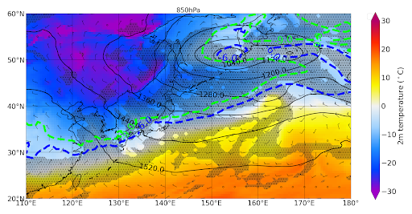
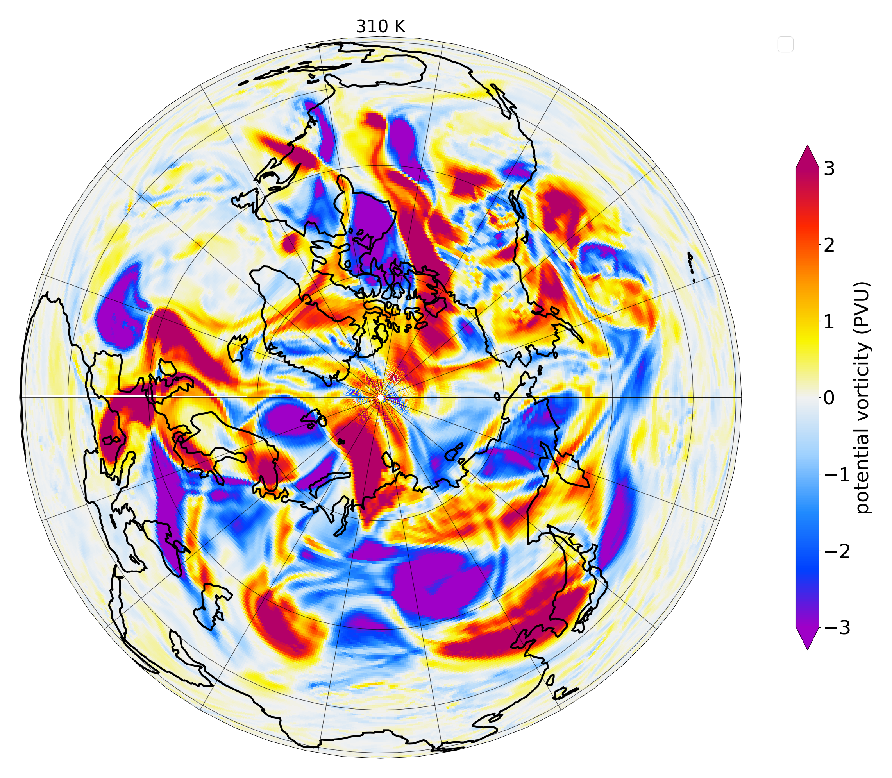

[ENGLISH versipon README-en.md](./README.md)
# INDEX (README.md is WIP)
Read netcdf and make meteorogical figures.

- [ABOUT](#ABOUT)
- [EXAMPLE](#EXAMPLE)
- [ENVIRONMENT](#ABOUT)
- [INSTALATION](#INSTARATION)
- [INFORMATION](#INFORMATION)

# EXAMPLE



# ABOUT
This repository Programs are created to analyze netcdf meteorogical data.
If you need reanalysis data, please download from [GPV](http://database.rish.kyoto-u.ac.jp/arch/glob-atmos/) or [JRA-55](https://auth.diasjp.net/cas/login?service=https%3A%2F%2Fdata.diasjp.net%2Fdl%2Fstorages%2Ffilelist%2Fdataset%3A204%2Flang%3Aja)

# ENVIRONMENT
I used the following environment.
- Python3.8
- Ubuntu 20.04 LTS or MacOS Catalina

I think these program can be used other environment. But, I didn't test it.

# INSTALLATION

```shell
# using package install
pip install -r requirements.txt
```

# INFORMATION
## ncMagics/
Composed by modules. See [ncMagics_document](./ncmagics/README.md)

## mk_ave/
Make average data netcdf file.

## getPrmsl.sh
- **If one netcdf file has only one dimension time data, you don't have to use [getPrmsl.bash](./getPrmsl.bash)**.
- Physical parameter "prmsl" is [Pa].So, convert it [hPa].

```bash
$ls ~/winter #Data root directory
2020120100/ 2020121112/ 2020122200/ 2021010112/ 2021011200/ 2021012212/ ...
$ls 2020120100/
apcp.nc                          surface-2020-12-03_18-prmsl_hPa
stratosphere.nc                  surface-2020-12-04_00
surface-2020-12-01_00            surface-2020-12-04_00-prmsl_hPa
surface-2020-12-01_00-prmsl_hPa  surface-2020-12-04_06
surface-2020-12-01_06            surface-2020-12-04_06-prmsl_hPa
surface-2020-12-01_06-prmsl_hPa  surface-2020-12-04_12
surface-2020-12-01_12            surface-2020-12-04_12-prmsl_hPa
surface-2020-12-01_12-prmsl_hPa  surface-2020-12-04_18
surface-2020-12-01_18            surface-2020-12-04_18-prmsl_hPa
surface-2020-12-01_18-prmsl_hPa  surface-2020-12-05_00
surface-2020-12-02_00            surface-2020-12-05_00-prmsl_hPa
surface-2020-12-02_00-prmsl_hPa  surface-2020-12-05_06
surface-2020-12-02_06            surface-2020-12-05_06-prmsl_hPa
surface-2020-12-02_06-prmsl_hPa  surface-2020-12-05_12
surface-2020-12-02_12            surface-2020-12-05_12-prmsl_hPa
surface-2020-12-02_12-prmsl_hPa  surface-2020-12-05_18
surface-2020-12-02_18            surface-2020-12-05_18-prmsl_hPa
surface-2020-12-02_18-prmsl_hPa  surface-2020-12-06_00
surface-2020-12-03_00            surface-2020-12-06_00-prmsl_hPa
surface-2020-12-03_00-prmsl_hPa  surface-2020-12-06_06
surface-2020-12-03_06            surface-2020-12-06_06-prmsl_hPa
surface-2020-12-03_06-prmsl_hPa  surface-2020-12-06_12
surface-2020-12-03_12            surface-2020-12-06_12-prmsl_hPa
surface-2020-12-03_12-prmsl_hPa  surface.nc
surface-2020-12-03_18            troposphere.nc
```
- All directory has 4 netcdfFile, e.g., surface.nc,stratosphere.nc,troposphere.nc,apcp.nc. My target is surface.nc and it contains saveral different time data.
- So, using [getPrmsl.bash](./getPrmsl.bash), "surface.nc" can be divided by time.

