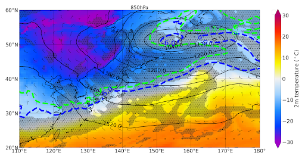
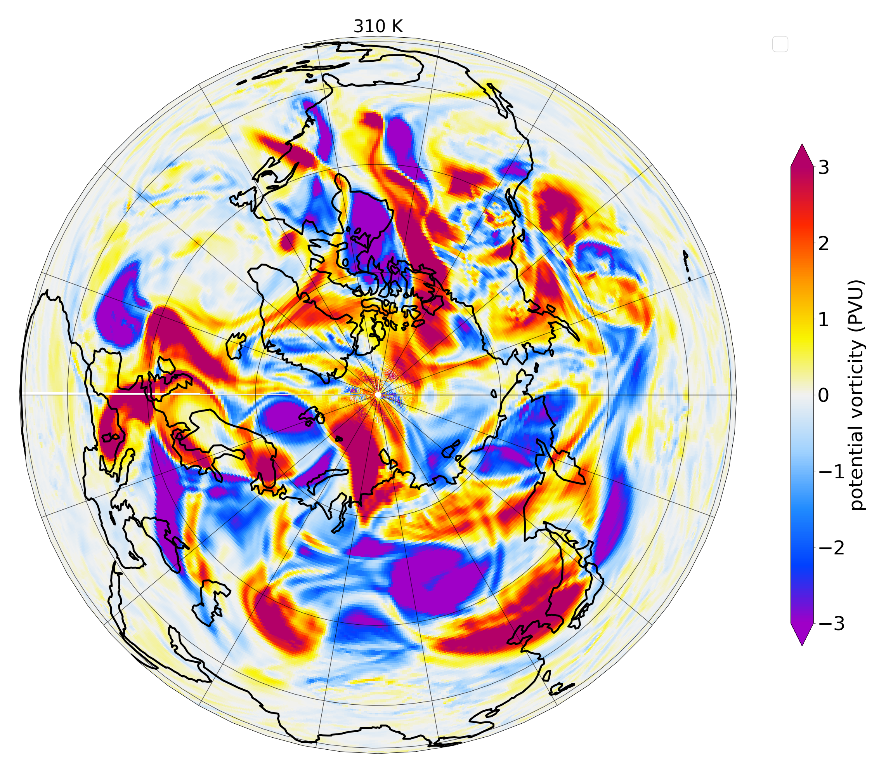

[ENGLISH versipon README-en.md](./README-en.md)
# INDEX
netcdf形式のファイルを読み込んで気象学でよく使う物理量を計算しプロットします。

- [ABOUT](#ABOUT)
- [EXAMPLE](#EXAMPLE)
- [ENVIRONMENT](#ABOUT)
- [INSTALATION](#INSTARATION)
- [INFORMATION](#INFORMATION)

# EXAMPLE



# ABOUT
netcdf形式の解析データはこちらからダウンロードできます。[GPV](http://database.rish.kyoto-u.ac.jp/arch/glob-atmos/) or [JRA-55](https://auth.diasjp.net/cas/login?service=https%3A%2F%2Fdata.diasjp.net%2Fdl%2Fstorages%2Ffilelist%2Fdataset%3A204%2Flang%3Aja)

# ENVIRONMENT
- Python3.8
- Ubuntu 20.04
他の環境でも動くと思いますがテストはしていませんのでご了承ください。

# INSTALLATION
必要なライブラリはpipで一括でインストールできます。

```shell
# using package install
pip install -r requirements.txt
```

# INFORMATION
## ncMagics/
pyfiles listにあるプログラムを動かすのに使う自作モジュールを集めたディレクトリです。[ncMagics_document](./ncmagics/README.md)参照。

## pyfiles list
[program.md](./program.md)参照。それぞれのプログラムについての説明が載っています。

## mk_ave/
GPVの12時間毎のデータから6時間毎のデータを生成するのに使ったスクリプトです。

## getPrmsl.sh
GPVのデータはもともと初期時刻の異なる予報値が同じファイルに格納されていたのでそれらを分離するスクリプトです。
ディレクトリ構成は以下を想定しています。

```bash
$ls ~/winter #Data root directory
2020120100/ 2020121112/ 2020122200/ 2021010112/ 2021011200/ 2021012212/ ...
$ls 2020120100/
apcp.nc                          surface-2020-12-03_18-prmsl_hPa
stratosphere.nc                  surface-2020-12-04_00
surface-2020-12-01_00            surface-2020-12-04_00-prmsl_hPa
surface-2020-12-01_00-prmsl_hPa  surface-2020-12-04_06
surface-2020-12-01_06            surface-2020-12-04_06-prmsl_hPa
surface-2020-12-01_06-prmsl_hPa  surface-2020-12-04_12
surface-2020-12-01_12            surface-2020-12-04_12-prmsl_hPa
surface-2020-12-01_12-prmsl_hPa  surface-2020-12-04_18
surface-2020-12-01_18            surface-2020-12-04_18-prmsl_hPa
surface-2020-12-01_18-prmsl_hPa  surface-2020-12-05_00
surface-2020-12-02_00            surface-2020-12-05_00-prmsl_hPa
surface-2020-12-02_00-prmsl_hPa  surface-2020-12-05_06
surface-2020-12-02_06            surface-2020-12-05_06-prmsl_hPa
surface-2020-12-02_06-prmsl_hPa  surface-2020-12-05_12
surface-2020-12-02_12            surface-2020-12-05_12-prmsl_hPa
surface-2020-12-02_12-prmsl_hPa  surface-2020-12-05_18
surface-2020-12-02_18            surface-2020-12-05_18-prmsl_hPa
surface-2020-12-02_18-prmsl_hPa  surface-2020-12-06_00
surface-2020-12-03_00            surface-2020-12-06_00-prmsl_hPa
surface-2020-12-03_00-prmsl_hPa  surface-2020-12-06_06
surface-2020-12-03_06            surface-2020-12-06_06-prmsl_hPa
surface-2020-12-03_06-prmsl_hPa  surface-2020-12-06_12
surface-2020-12-03_12            surface-2020-12-06_12-prmsl_hPa
surface-2020-12-03_12-prmsl_hPa  surface.nc
surface-2020-12-03_18            troposphere.nc
```
